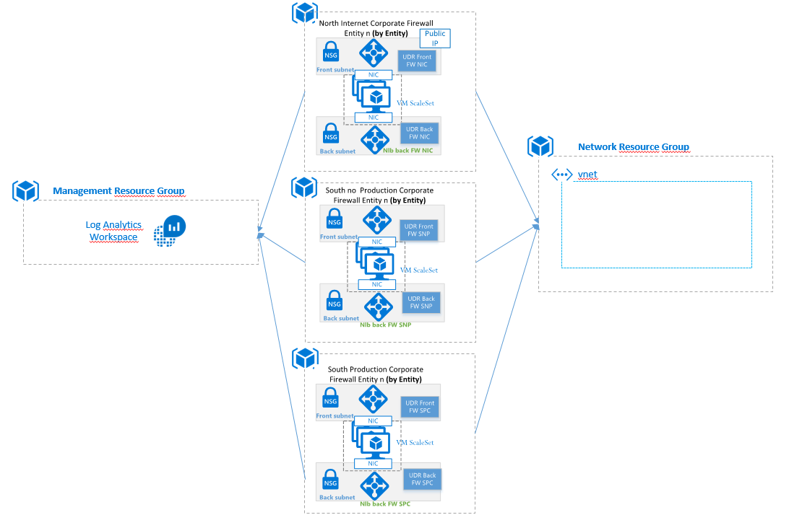
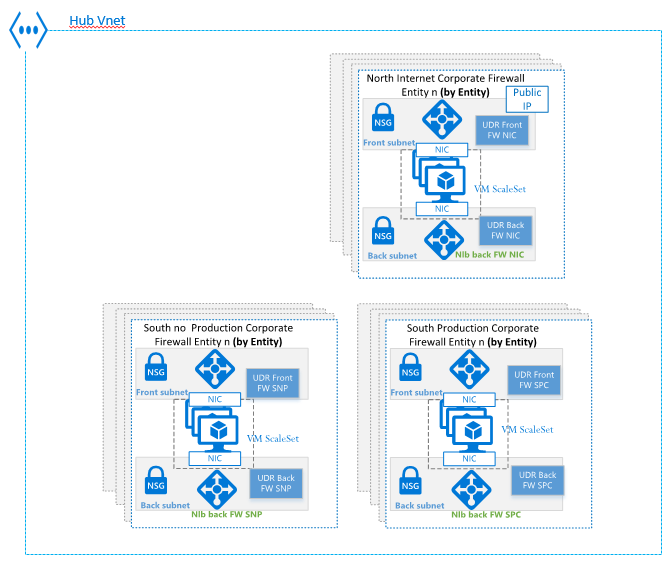

**HUB NVAs Deployment Blueprint**

## Overview

### Description

This blueprint deploys the NVAs and architecture necessary to provide the Entity presence in the HUB environment. This blueprint deploys the following three groups of objects:

##### North Internet Corporate Firewall Entity

- 2 Load Balancers (lba)
  - Frontend Load Balancer (external load balancer)
  - Backend Load Balancer (internal load balancer)
- 1 Virtual Machine Scale Set
- 1 Public IP Prefix

##### South Production Corporate Firewall Entity

- 2 Load Balancers (lba)
  - Frontend Load Balancer (external load balancer)
  - Backend Load Balancer (internal load balancer)
- 1 Virtual Machine Scale Set
- 1 Public IP Prefix

##### South no Production Corporate Firewall Entity

- 2 Load Balancers (lba)
  - Frontend Load Balancer (external load balancer)
  - Backend Load Balancer (internal load balancer)
- 1 Virtual Machine Scale Set
- 1 Public IP Prefix

### Configuration

The product supports the [common configuration parameters](https://dev.azure.com/SantanderCCoE/CCoE/_wiki/wikis/CCoE.wiki?wikiVersion=GBwikiMaster&pagePath=%2FWay%20of%20Working%2FProducts%2FProduct%20Parameters&pageId=83) for all certified products

Additionally the product supports the following custom configuration:

#### Common Parameters

|Parameter |	Tf Name	| Default Value|	Type|	Mandatory|	Others|
|--|--|--|--|--|--|
|Entity	|entity	|n/a	| String|	yes|	 |
|Location|	location	|n/a |	String|	yes|	|
|Id of the Azure Subscription	|subscription_id	|n/a	|String|	yes	|
|resource group nic name|	resource_group_nic_name	| n/a	|String|	yes	| Resource Group to deploy NIC NVA. |
|resource group spc name|	resource_group_spc_name	| n/a	|String|	yes	| Resource Group to deploy SPC NVA.|
|resource group snc name|	resource_group_snc_name	| n/a	|String|	yes	| Resource Group to deploy SNC NVA. |

#### Networking Parameters

NVA Parameters

|Parameter|Tf Name| Default Value|Type|	Mandatory|Others|
|--|--|--|--|--|--|
|vnet resource group name|	vnet_resource_group_name	| n/a	|String|	yes	| The name of the resource group where the vnet exists.|
|vnet name|	vnet_name	| n/a	|String|	yes	| The name of the virtual network.|
|snt front nic name| snt_front_nic_name	| n/a	|String|	yes	| Subnet for Front NIC.|
|snt back nic name|	snt_back_nic_name	| n/a	|String|	yes	| Subnet for Back NIC.|
|snt front spc name| snt_front_spc_name	| n/a	|String|	yes	| Subnet for Front SPC.|
|snt back spc name| snt_back_spc_name	| n/a	|String| yes | Subnet for Back SPC.|
|snt front snc name| snt_front_snc_name	| n/a	|String| yes | Subnet for Front SNC.|
|snt back snc name| snt_back_snc_name	| n/a	|String| yes | Subnet for Back SNC.|

#### Key Vault parameters

|Parameter |	Tf Name	| Default Value|	Type|	Mandatory|	Others|
|--|--|--|--|--|--|
|Id of the Key Vault that stores the sicKey and CloudGuard password for NIC|	key_vault_id_nic	|n/a|	String|	yes	| The Id of the Key Vault|
|Id of the Key Vault that stores the sicKey and CloudGuard password for SPC|	key_vault_id_spc	|n/a|	String|	yes	| The Id of the Key Vault|
|Id of the Key Vault that stores the sicKey and CloudGuard password for SNC|	key_vault_id_snc	|n/a|	String|	yes	| The Id of the Key Vault|

#### Log Analytics Diagnostics Parameters

|Parameter |	Tf Name	| Default Value|	Type|	Mandatory|	Others|
|--|--|--|--|--|--|
|ID of the Log Analytics Workspace for NIC|	lwk_id_nic	|n/a|	String|	yes	| ID of the Log Analytics Workspace|
|ID of the Log Analytics Workspace for SPC|	lwk_id_spc	|n/a|	String|	yes	| ID of the Log Analytics Workspace|
|ID of the Log Analytics Workspace for SNC|	lwk_id_snc	|n/a|	String|	yes	| ID of the Log Analytics Workspace|

#### Storage Account Parameters

|Parameter |	Tf Name	| Default Value|	Type|	Mandatory|	Others|
|--|--|--|--|--|--|
|Storage Account Nam for NIC|	sa_name_nic	|n/a|	String|	yes	| Storage Account Name to save the vmss boot diagnostics|
|Storage Account Nam for SPC|	sa_name_spc	|n/a|	String|	yes	| Storage Account Name to save the vmss boot diagnostics|
|Storage Account Nam for SNC|	sa_name_snc	|n/a|	String|	yes	| Storage Account Name to save the vmss boot diagnostics|

#### NVA Parameters

|Parameter |	Tf Name	| Default Value|	Type|	Mandatory|	Others|
|--|--|--|--|--|--|
|Name of the CloudGuard Management Server	|	managementServer	|n/a|	String|	yes	| Name of the management server|

#### IP Publications

|Parameter |	Tf Name	| Default Value|	Type|	Mandatory|	Others|
|--|--|--|--|--|--|
|List of Public IP names	|	pip_names_list	|n/a|	list(string)|	no	| |
|List of protocol by a load balancer rule	|	protocols_list	|n/a|	list(string)|	no	| |
|List of fronted ports used by a load balancer rule	|	frontend_ports_list	|n/a|	list(string)|	no	| |
|List of backend ports used by a load balancer rule	|	backend_ports_list	|n/a|	list(string)|	no	| |

### Public Documentation

There is not specific public documentation about this blueprint but the following documentation could be consulted for architecture understanding:

[Deploy highly available network virtual appliances](https://docs.microsoft.com/en-us/azure/architecture/reference-architectures/dmz/nva-ha)

### Version

|Version|Target SCF|
|:--|:--|
|1.2|SM|

### Dependencies

The following resources and requirements must exist before the deployment can take place:

- Azure Subscription
- Log Analytics Workspace (formerly OMS) for health logs and metrics
- A Key Vault that stores the sicKey and CloudGuard password (it is the same password for both secrets). 
- A deployment Service Principal with owner permissions on the resource group and with access in the Key Vault to get the secrets.
  * Please, request to Protect's team the creation and store of the secret in other HUBs.
- A CloudGuard management controller (management server)
  * The management server used in Europe and Brasil is cybp1weunvav001. Please, confirm this value with Protect's team for each deployment. 
- An Azure application to manage the subscription from the management server. It is necessary an Azure application for each HUB/subscription 
  * Please, confirm the name of this application with Protect and assign it contributor permissions in the subscription.
Typically are named SP_CloudGuardControllerxxx
- A template in the CloudGuard management controller
  * The template is a configuration file that is provided to the NVAs from the management server. 
Typically, those templates are named:
    1. NIC template is named <entity>fwinet30
    2. SPC template is named <entity>fwpro30
    3. SNCtemplate is named <entity>fwnopro30
  * Please, confirm with Protect's team the existence and name of those configuration files. The name is build automatically so must fit with the previous naming convention.
- The backend LBs addressing is calculated with the cidrhost terraform function providing the 6th hostnumber in the backend range.
  * Examples: 1. Backend Subnet 107.104.26.224/27 → Backend LB IP 107.104.26.230

### Target Audience

|Audience |Purpose  |
|--|--|
| Cloud Center of Excellence | Understand the Design of this Service |
| Cybersecurity Hub | Understand how the Security Framework is implemented in this Service and who is responsible of each control |
| Service Management Hub | Understand how the Service can be managed according to the Service Management Framework |

## Architecture

## Networking

### Network topology

### Exposed product endpoints
The following endpoints can be used to consume or manage the Certified Product:

#### Management endpoints (Control Plane)

These endpoints will allow to make changes in the configuration of the Certified Service, change permissions or make application deployments.

|EndPoint|IP/URL  |Protocol|Port|Authorization|
|:-|:-|--|--|:-|
|Azure Resource Management REST API|https://management.azure.com/|HTTPS|443|Azure Active Directory|

# **Security Framework**
This section explains how the different aspects to have into account in order to meet the Security Control Framework for this Certified Service. 

This product has been certified for the [Security Control Framework v1.2](https://teams.microsoft.com/l/file/E7EFF375-EEFB-4526-A878-3C17A220F63C?tenantId=72f988bf-86f1-41af-91ab-2d7cd011db47&fileType=docx&objectUrl=https%3A%2F%2Fmicrosofteur.sharepoint.com%2Fteams%2FOptimum-SanatanderAzureFoundationsProject%2FShared%20Documents%2FCCoE-Channel%2FSecurity%20Control%20Framework%2FSantander%20-%20CCoE%20-%20Security%20Control%20Framework%20-%20v1.2.docx&baseUrl=https%3A%2F%2Fmicrosofteur.sharepoint.com%2Fteams%2FOptimum-SanatanderAzureFoundationsProject&serviceName=teams&threadId=19:e20a3726dc824141b32579df437f7a66@thread.skype&groupId=26385c5b-85e4-4376-988a-27ed549d9419) revision.

## Security Controls based on Security Control Framework

### Foundation (**F**) Controls for Rated Workloads
|SF#|What|How it is implemented in the Product|Who|
|--|:---|:---|:--|
|SF1|Resource Tagging on all resources|Product includes all required tags in the deployment template|CCoE|
|SF2|IAM on all accounts|<ul><li>**Data channel**: The data channel is used for transferring data between on-premises data stores and cloud data stores.CCoE RBAC model for products certifies right level of access to the Data Factory. Only Azure AD RBAC access is enabled for the product</li><li>**The command channel**: The development team should implement AzureAd based authentication and authorization to control access.The command channel allows communication between data movement services in Data Factory and self-hosted integration runtime.IAM source depend of provider.</li></ul>|CCoE/DevOps|
|SF3|MFA on accounts|This is governed by Azure AD|Protect|
|SF4|Platform Activity Logs & Security Monitoring|After you have successfully built and deployed your data integration pipeline, providing business value from refined data, monitor the scheduled activities and pipelines for success and failure rates. Azure Data Factory has built-in support for pipeline monitoring via Azure Monitor, API, PowerShell, Azure Monitor logs, and health panels on the Azure portal. Data Factory Analatics will be deployed to centralize the product monitor|CCoE|
|SF5|Virus/Malware Protection|Doesn't apply since this is a PaaS (not IaaS) service||

### Medium (**M**) Controls for Rated Workloads
|SM#|What|How it is implemented in the Product|Who|
|--|:---|:---|:--|
|SM1|Encrypt data at rest using application or server level encryption|Doesn't apply since Data Factory doesn't store data||
|SM2|Customer managed keys|Key Vault linked will keep the credential source provider||
|SM3|Encrypt data in transit over public interconnections|If the cloud data store supports HTTPS or TLS, all data transfers between data movement services in Data Factory and a cloud data store are via secure channel HTTPS or TLS .|CCoE|
|SM4|Control resource geography|Certified Product location can be configured using product deployment parameters. For a list of Azure regions in which Data Factory is currently available [Azure Data Factory Regions](https://azure.microsoft.com/en-us/global-infrastructure/services/?products=data-factory&regions=all) |DevOps|

### Application (**P**) Controls for Rated Workloads
|SP#|What|How it is implemented in the Product|Who|
|--|:---|:---|:--|
|SP1|Segregation of Duties| n/a ||
|SP2|Vulnerability Management|Detect is responsible for vulnerability scanning of public endpoints|Detect|
|SP3|Security Configuration & Patch Management|This is a **PaaS** service, product upgrade and patching is done by CSP, for the artifacts deployed the DevOps team is responsible for upgrading any application framework used by the app to the right patching level|MS/DevOps|
|SP4|Service Logs & Security Monitoring|Product is connected to Log Analytics for activity and security monitoring. The monitoring of pipelines and other funtions of the product will be configured to be monitoring with Data Factory Analytics .|CCoE|
|SP5|Privileged Access Management|**Data Channel**: Access to data plane is not considered Privileged Access. **Command channel**: AzureAd based authentication and authorization to control access. **ARM**: Access to the control plane is considered Privileged Access and is governed as per the [Azure Management Endpoint Privileged Access Management]() policy.  |Protect|
|SP6|Network Security Perimeter|**SP6.1**: DevOps can configure the isolated network by leveraging the product built in Virtual Firewall & Service Endpoints **SP6.2**: Virtual Firewall can be used to deny incoming traffic, built in Azure DDoS protection for PaaS/SaaS services **SP6.3**: Virtual Firewall can be used to deny incoming traffic, built in Azure DDoS protection for PaaS/SaaS services **SP6.4,SP6.5**: Doesn't apply **SP6.6**: Virtual Firewall can be used to deny incoming traffic, built in Azure DDoS protection for PaaS/SaaS services **SP6.7**: : Doesn't apply **SP6.8**: : Doesn't apply |DevOps, CCoE|
|SP7|Advanced Malware Protection|Doesn't apply||

**Product Artifacts**

This section explain the structure and elements that represent the artifacts of product.

|Folder|Name|Description
|--|:-|--|
|Documentation|network_diagram.png|Network topology diagram|
|Documentation|architecture_diagram.png|Architecture diagram|
|Root|Readme.md|Product documentation file|
|Root|main.tf|Terraform file to use in pipeline to build and release a product|
|Root|outputs.tf|Terraform file to use in pipeline to check output|
|Root|variables.tf|Terraform file to use in pipeline to configure product|

# **Links to internal documentation**
<!--
**Reference documents** :  
- [List of Acronyms](https://confluence.ci.gsnet.corp/display/OPTIMUM/List%2Bof%2BAcronyms)
- [Naming Convention for Repos](https://confluence.ci.gsnet.corp/display/OPTIMUM/Naming+Convention+for+Azure+resources)
- [Repo module strategy for terraform](https://confluence.ci.gsnet.corp/display/OPTIMUM/Repo+module+strategy+for+Terraform)
- [Product Portfolio](https://confluence.ci.gsnet.corp/display/OPTIMUM/CCoE+Product+Portfolio)
- [Naming Convention for Azure Resources](https://confluence.ci.gsnet.corp/display/OPTIMUM/Naming+Convention+for+Azure+resources)
-->
**Reference documents** :
- [List of Acronyms](https://confluence.alm.europe.cloudcenter.corp/display/OPTIMUM/List+of+Acronyms)
- [Naming Convention for Repos](https://confluence.alm.europe.cloudcenter.corp/display/OPTIMUM/AZ+Naming+Convention+for+Azure+resources)
- [Repo module strategy for terraform](https://confluence.alm.europe.cloudcenter.corp/display/OPTIMUM/Repo+module+strategy+for+Terraform)
- [Product Portfolio](https://confluence.alm.europe.cloudcenter.corp/display/OPTIMUM/CCoE+Product+Portfolio)
- [Naming Convention for Azure Resources](https://confluence.alm.europe.cloudcenter.corp/display/OPTIMUM/AZ+Naming+Convention+for+Azure+resources)
